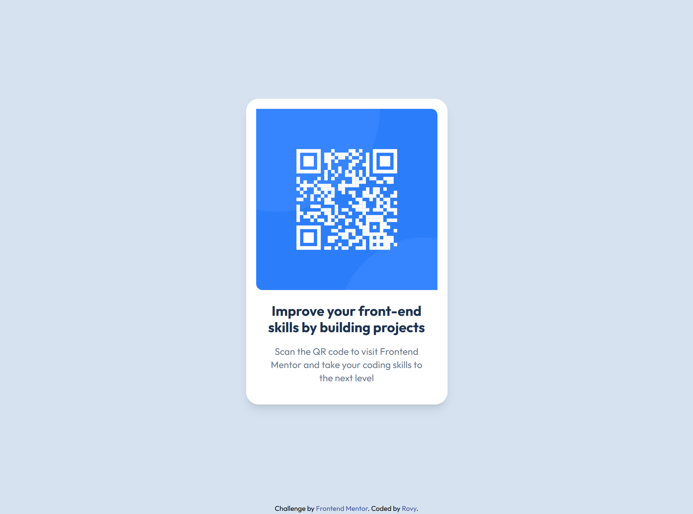

# Frontend Mentor - QR code component solution

This is a solution to the [QR code component challenge on Frontend Mentor](https://www.frontendmentor.io/challenges/qr-code-component-iux_sIO_H). Frontend Mentor challenges help you improve your coding skills by building realistic projects. 

## Table of contents

- [Overview](#overview)
  - [Screenshot](#screenshot)
  - [Links](#links)
- [My process](#my-process)
  - [Built with](#built-with)
  - [What I learned](#what-i-learned)
  - [Continued development](#continued-development)
  - [Useful resources](#useful-resources)
  - [AI Collaboration](#ai-collaboration)
- [Author](#author)


## Overview

### Screenshot



### Links

### Links

- Solution URL: [GitHub repository](https://github.com/rovyhonolario53-code/qr-code-frontend-mentor)
- Live Site URL: [GitHub Pages](https://rovyhonolario53-code.github.io/qr-code-frontend-mentor/)

## My process

### Built with

- Semantic HTML5 markup
- Flexbox
- Mobile-first workflow
- [Tailwind CSS](https://tailwindcss.com/) v4 - For styling

### What I learned

This is the first project that I had to setup from the ground up, so naturally I learned many things.
One of it is setting up the Tailwind. I know you can setup Tailwind for small projects like this by linking it, but I found out that I've been actually using an outdated version of Tailwind CSS.

One important thing I learned as well is how to link fonts with Tailwind. Turns out, you can't just link a font then use it as a utility class. You'll have to use:

```html
  <link rel="stylesheet" href="https://fonts.googleapis.com/css2?family=Outfit:wght@400;700&display=swap">
  <script src="https://cdn.jsdelivr.net/npm/@tailwindcss/browser@4"></script>
  <style type="text/tailwindcss">
  @theme {
    --font-outfit: "Outfit", sans-serif;
  }
</style>
```
In this project, I learned the right way to structure the files, as well as linking them. Its crucial that I learned this and I have been wanting to learn it since I was used to being spoonfed and all I had to do is write code.

### Continued development

I'd like to keep learning about Tailwind CSS. Sometimes I find myself lost on what is the equivalent utility class of a CSS property. It would be helpful in the future as it saves me time instead of searching or figuring it out.

### Useful resources

- [Tailwind CSS docs](https://tailwindcss.com/docs) - Helped me with arbitrary values like `w-[288px]` and the `@theme` setup.
- [Figpea](https://figpea.com) - Used the Inspect tab to read font sizes, colors, and spacing from the design file.

### AI Collaboration

For this project, I really wanted to write it without AI. I wrote it myself but I used AI on figuring out utility classes and for teaching me the process of creating this project. Since I was new to this setup, I was a little overwhelmed by the files and how they were supposed to be used. Claude was really helpful for clearing out confusions and giving me tips.

## Author

- Frontend Mentor - [@Rovy Rain](https://www.frontendmentor.io/profile/rovyhonolario53-code)
- Github - [@rovyhonolario53-code](https://github.com/rovyhonolario53-code)


